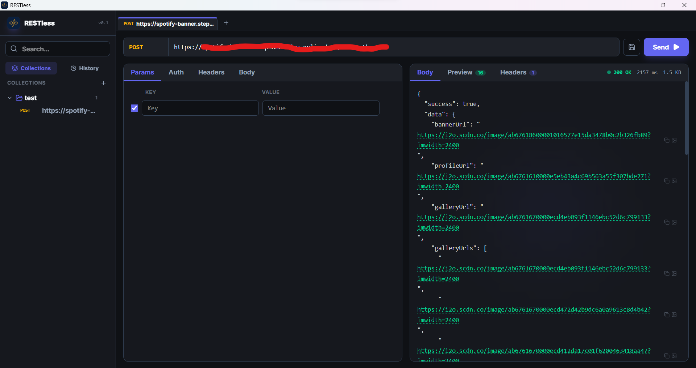

<div align="center">
  
  <h1>RESTless</h1>
</div>

RESTless is a minimalist, **local-first** REST API client built for developers who want a fast, lightweight, and private tool to test and manage their HTTP requests.

Because RESTless is a **local-first** application, all of your data—including your request history, saved collections, and configurations—is stored securely on your local device using IndexedDB (via Dexie.js). None of your requests or history are ever sent to an external server.

<div align="center">
  
</div>

## Features

- **Local-First Architecture**: Your data never leaves your device. Everything is saved locally for maximum privacy and speed.
- **Request History**: Automatically saves a history of your past requests.
- **Collections**: Organize and save your frequently used API requests into collections.
- **Authentication Helpers**: Built-in support for generating Auth headers, including Bearer tokens, Basic Auth, OAuth2, AWS Signature V4, and Digest Auth.
- **Minimalist UI**: Clean, distraction-free interface.
- **Desktop Support**: Available as a native desktop application using Tauri.

## Tech Stack

- **Frontend**: React 19, TypeScript, Vite
- **Styling**: Tailwind CSS, Lucide Icons
- **State Management**: Zustand
- **Database**: Dexie.js (IndexedDB wrapper)
- **Desktop Framework**: Tauri (Rust)

## Getting Started

### Prerequisites

To run this project, you will need:
- [Node.js](https://nodejs.org/) (v18 or newer)
- [Rust](https://www.rust-lang.org/tools/install) (for building the desktop app)

### Clone and Setup

1. Clone the repository:
   ```bash
   git clone https://github.com/Momotz4G/RESTless.git
   cd RESTless
   ```

2. Install dependencies:
   ```bash
   npm install
   ```

3. Run the development server (web):
   ```bash
   npm run dev
   ```

### Building the Windows App

To compile and package RESTless as a native Windows desktop application:

1. Ensure all Rust and Tauri prerequisites are installed on your machine.
2. Run the Tauri build command:
   ```bash
   npx tauri build
   ```
3. Once the build finishes, you can find your compiled executables and installers in the following paths:
   - Standalone: `src-tauri/target/release/RESTless.exe`
   - Installer (NSIS): `src-tauri/target/release/bundle/nsis/`
   - Installer (MSI): `src-tauri/target/release/bundle/msi/`
